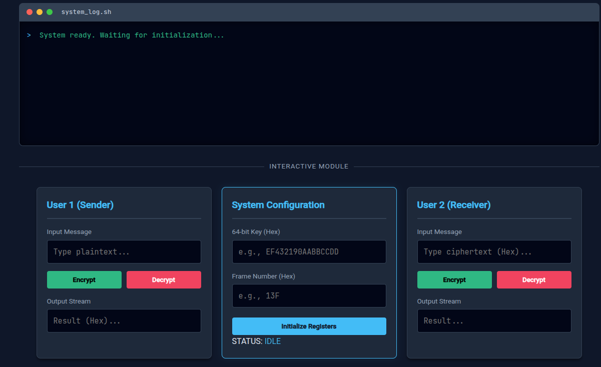

  # 🔒 A5/1 Stream Cipher Visualization
  
  **A Web-Based Simulation of the GSM Mobile Network Encryption Standard**

  
  
  

  

    
  

---

## 📖 Abstract
This project is a comprehensive implementation and visualization of the **A5/1 Stream Cipher**, a cryptographic algorithm originally used to provide over-the-air communication privacy in the GSM cellular telephone standard. 

The tool provides an interactive "Glass Box" approach, allowing users to visualize the internal state changes of the three Linear Feedback Shift Registers (LFSRs) and the majority vote clocking mechanism in real-time.

## 🛠️ Tech Stack

## ✨ Features
- **Full LFSR Simulation**: Accurate representation of R1 (19-bit), R2 (22-bit), and R3 (23-bit) registers.
- **Majority Vote Clocking**: visually demonstrates the "stop/go" motion of registers based on clock bits.
- **Hexadecimal Support**: Inputs and outputs are processed in Hex for cryptographic standard compliance.
- **System Terminal**: A simulated terminal log (`system_log.sh`) that displays backend process steps and keystream generation logs.

## 📸 Screenshots
### The Dashboard

## 🚀 Usage
Access the hosted version directly via GitHub Pages:
[**Launch A5/1 Visualizer**](https://rahulshankarv52.github.io/A5-1_StreamCipherDemo/)

| ProjectTeamRole | Name |
|-----------------|------|
| Mentor | Mr. Saurabh Shrivastava |
| Member | R. Sruthi |
| Member | Rahul Shankar V|
| Member | Rathnesh | 
| Member | Ramraj S | 
### 📚 References
Theory: AsecurtitySite - A5/1 Stream Cipher
Logic: Python Implementation by dkushagra
Course: Modern Cryptography (UG - Batch 22CYS)

Built for the Modern Cryptography Project

